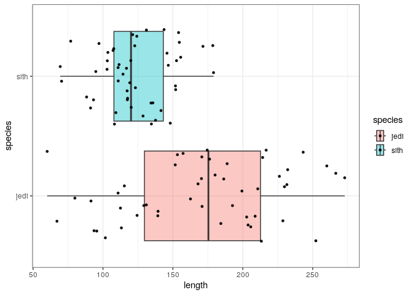
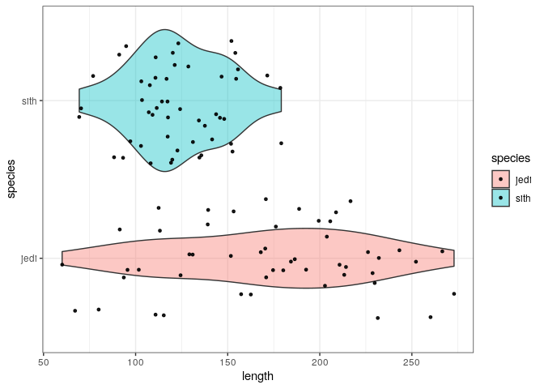
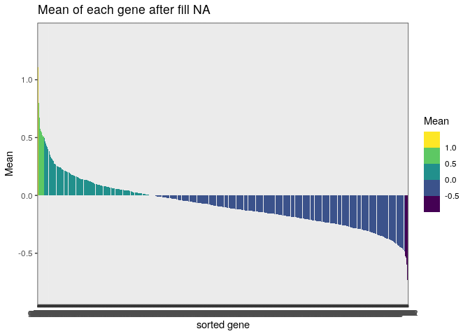
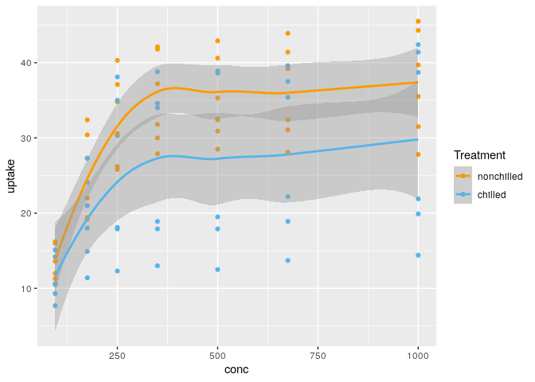

Task7
================
Gina Miku Oba
2023-03-07

# Task7 - Basic visualization with R

First import libraries:

``` r
library(tidyverse)
```

    ## ── Attaching core tidyverse packages ──────────────────────── tidyverse 2.0.0 ──
    ## ✔ dplyr     1.1.0     ✔ readr     2.1.4
    ## ✔ forcats   1.0.0     ✔ stringr   1.5.0
    ## ✔ ggplot2   3.4.1     ✔ tibble    3.1.8
    ## ✔ lubridate 1.9.2     ✔ tidyr     1.3.0
    ## ✔ purrr     1.0.1     
    ## ── Conflicts ────────────────────────────────────────── tidyverse_conflicts() ──
    ## ✖ dplyr::filter() masks stats::filter()
    ## ✖ dplyr::lag()    masks stats::lag()
    ## ℹ Use the ]8;;http://conflicted.r-lib.org/conflicted package]8;; to force all conflicts to become errors

``` r
library(ggplot2)
```

## 1. magic_guys.csv dataset

Tasks: Compare the distributions of the body heights of the two species
from the ‘magic_guys.csv’ dataset.

### a-1. Data loading

Load `magic_guys.csv` using `read_csv()`:

``` r
magic_guys <- read_csv("../data/magic_guys.csv")
```

    ## Rows: 100 Columns: 4
    ## ── Column specification ────────────────────────────────────────────────────────
    ## Delimiter: ","
    ## chr (2): uniqId, species
    ## dbl (2): length, weight
    ## 
    ## ℹ Use `spec()` to retrieve the full column specification for this data.
    ## ℹ Specify the column types or set `show_col_types = FALSE` to quiet this message.

``` r
unique_values <- unique(magic_guys$species)
print(unique_values)
```

    ## [1] "jedi" "sith"

``` r
sum(magic_guys$species == "jedi")
```

    ## [1] 50

The dataset named magic_guys.csv contains 100 observations (row) which
include 50 individuals of `jedi` and 50 individuals of `sith`. There are
four variables (column), which are unique id, species (`jedi` or
`sith`), length and weight.

### a-2. Visualization of histograms - `hist()`

Plot distribution of body heights using `hist()`:

``` r
# This plot will be plot all data as one distribution.
hist(magic_guys$length)
```

<!-- -->

If all data in magic_guys\$length is passed to the `hist()`, all data is
plotted in the same distribution.

If we want to compare the distributions of the body heights of the two
species, we need to separate data of 2 species before plot histogram to
separate distribution of 2 samples. It can be observed that the group of
“jedi” has a wider dispersion in taller population than the group of
“sith”.

``` r
# Separate data of 2 species
sp_j <- filter(magic_guys, species == "jedi")
sp_s <- filter(magic_guys, species == "sith")

# plot distribution
# last 2 letter of #ff00ff40 is for alpha of the color.
# set xlim and ylim to plot all distribution.
# set the same breaks to compare the same bin size.
breaks <- seq(0,max(magic_guys$length)+50, 20)
hist(sp_j$length, col = "#ff00ff40", xlim=c(0,max(magic_guys$length)+100), ylim=c(0,20), breaks = breaks,
     main="distribution of height of 2 species") # main to set title
hist(sp_s$length, col = "#0000ff40", xlim=c(0,max(magic_guys$length)+100), ylim=c(0,20), breaks = breaks, add = TRUE) # add = TRUE to overlap 2 plot
```

<!-- -->

### a-3. Visualization of histograms - `ggplot2`

We can use `ggplot()` and `geom_histogram()` to plot the distribution as
well.

``` r
# binwidth seems a close option of breaks in hist() function.
ggplot(magic_guys,aes(x=length)) + 
  geom_histogram(binwidth = 20) +
  theme_bw() # white back ground theme
```

<!-- -->

If we pass all data of length in magic_guys, the output plot shows only
one distribution. To plot each distribution for the two species, we can
use the options `fill` and `position`. The resulting plot is almost the
same, but the default rule of the bin is different with `hist()` and
`ggplot2`.

``` r
# set fill to plot 2 species separately
ggplot(magic_guys,aes(x=length, fill = species )) + 
  # set position as "identity" to overlay distribution
  # Also set color (black line of the bar) and alpha for visualization.
  geom_histogram(position = "identity", color = "black", alpha = 0.4, binwidth = 20) +
  xlim(0,max(magic_guys$length)+50) +
  theme_bw() + # white back ground theme
  ggtitle("Distribution of height of 2 species by ggplot2") # Title
```

    ## Warning: Removed 4 rows containing missing values (`geom_bar()`).

<!-- -->

### b. Visualization of boxplot - `ggplot2`

We can also compare the distribution of the two species using a boxplot.
The black line in the box shows the median of the data, and the length
of the box shows the interquartile range (IQR) which is 25% to 75% of
the data. By looking at the boxplot, we may conclude that the group of
“jedi” is taller than the group of “sith”.

``` r
# The argument of all x,y,fill in aes(x,y,fill) need to plot species separately.
ggplot(magic_guys,aes(x=length, y = species ,fill =species )) + 
  geom_boxplot(alpha = 0.4) + 
  theme_bw() # white back ground theme
```

<!-- -->

If we want to see each data point, we can add `geom_jitter()` layer on
top of the boxplot.

``` r
ggplot(magic_guys,aes(x=length, y = species ,fill =species )) + 
  geom_boxplot(alpha = 0.4) + 
  geom_jitter(color="black", size=1, alpha=0.9) + # plot data point
  theme_bw() # white back ground theme
```

<!-- -->

However, looking at each data point may not be enough to draw
conclusions. Therefore, we can use a violin plot to visualize the
distribution of the data as well. By looking at the violin plot, we can
conclude that the group of “jedi” has a wider dispersion in taller
population than the group of “sith”.

``` r
ggplot(magic_guys,aes(x=length, y = species ,fill =species )) + 
  # set position as "identity" to overlay distribution
  # Also set color (black line of the bar) and alpha for visualization.
  geom_violin(alpha = 0.4) + 
  geom_jitter(color="black", size=1, alpha=0.9) +
  theme_bw() # white back ground theme
```

<!-- -->

### c. Saving plots

To save plots in the `ggplot`, the function is `ggsave()`. The format of
the output figure is defined by `device` option (“eps”, “ps”, “tex”,
“pdf”, “jpeg”, “tiff”, “png”, “bmp”, “svg” or “wmf”).

PNG, PDF, and SVG are popular figure file formats with different best
use cases. PNG is suitable for web graphics and can maintain image
quality, but may result in a large file size and has a color mode that
may affect print colors. PDF is ideal for print documents but is not
easy to integrate into web pages. SVG is a vector format suitable for
the web but not for high-quality digital photographs. In conclusion, for
printing figures, PDF is the best option, and for web pages, SVG (not
for digital photos) and PNG (although heavy) are suitable choices.

**Best figure format Summary**

- Print: PDF
- Web (plot): PNG, SVG

``` r
ggplot(magic_guys,aes(x=length, fill = species )) + 
  # set position as "identity" to overlay distribution
  # Also set color (black line of the bar) and alpha for visualization.
  geom_histogram(position = "identity", color = "black", alpha = 0.4, binwidth = 20) +
  xlim(0,max(magic_guys$length)+50) +
  theme_bw() + # white back ground theme
  ggtitle("Distribution of height of 2 species by ggplot2")
```

    ## Warning: Removed 4 rows containing missing values (`geom_bar()`).

<!-- -->

``` r
ggsave("magic_guys_hist_ggplot2.png", device="png")
```

    ## Saving 7 x 5 in image

    ## Warning: Removed 4 rows containing missing values (`geom_bar()`).

``` r
ggsave("magic_guys_hist_ggplot2.pdf", device="pdf")
```

    ## Saving 7 x 5 in image

    ## Warning: Removed 4 rows containing missing values (`geom_bar()`).

``` r
ggsave("magic_guys_hist_ggplot2.svg", device="svg")
```

    ## Saving 7 x 5 in image

    ## Warning: Removed 4 rows containing missing values (`geom_bar()`).

If figure is not plotted by `ggplot2`, use `png()` or `pdf()` to save
images.

``` r
# This command causes an error when saving R notebook
## save as png
png("magic_guys_hist.png")

## plot block
breaks <- seq(0,max(magic_guys$length)+50, 20)
hist(sp_j$length, col = "#ff00ff40", xlim=c(0,max(magic_guys$length)+100), ylim=c(0,20), breaks = breaks, main="distribution of height of 2 species") # main to set title
hist(sp_s$length, col = "#0000ff40", xlim=c(0,max(magic_guys$length)+100), ylim=c(0,20), breaks = breaks, add = TRUE) # add = TRUE to overlap 2 plot

## close device
dev.off()
```

    ## png 
    ##   2

## 2. microarray_data.tab dataset

### a. How big is the matrix in terms of rows and columns?

Load `microarray_data.tab` using `read_tsv()`: This matrix contains 551
rows with 1000 columns (gene). The size of matrix is 551 x 1000. If data
is filled in all places in the matrix, count of value will be 551,000.

``` r
microarray_data <- read_tsv("../data/microarray_data.tab")
```

    ## Rows: 551 Columns: 1000
    ## ── Column specification ────────────────────────────────────────────────────────
    ## Delimiter: "\t"
    ## dbl (966): g1, g2, g3, g4, g5, g6, g7, g8, g9, g10, g11, g12, g13, g14, g15,...
    ## lgl  (34): g18, g55, g58, g79, g83, g99, g135, g137, g138, g329, g352, g368,...
    ## 
    ## ℹ Use `spec()` to retrieve the full column specification for this data.
    ## ℹ Specify the column types or set `show_col_types = FALSE` to quiet this message.

### b. Count the missing values per gene and visualize this result.

There are 115826 places with brank value (`NA`) thorough the matrix.
Missing values per gene will counted using `colSums()` function.

``` r
# count blank value (NA) thorough the matrix.
count_All_na = sum(is.na(microarray_data))
print(count_All_na)
```

    ## [1] 115826

``` r
# count blank value (NA) per gene
count_gens_na = colSums(is.na(microarray_data))
```

First, visualize the distribution of missing values per gene using the
histogram. It shows an interesting pattern. There are 4 peaks in the
distribution, which the first peak which is the largest is genes with
20-30 missing values, the second peak is genes with 180-190 missing
values, the third is around 350 missing values, and the fourth is around
550 missing values. Those genes which are in the 4th peak mean that the
gene is not or rare to be expressed in all samples.

``` r
# Convert named vector into data frame
count_gens_na_df <- data.frame(Value = count_gens_na, Name = names(count_gens_na))

# plot histogram
ggplot(count_gens_na_df,aes(x=Value)) + 
  geom_histogram(color = "black", alpha = 0.4, binwidth = 10) +
  theme_bw() + # white back ground theme
  # Title and x, y labels
  labs(title = "Distribution of missing value count per gene", x = "Missing value count", y = "Frequency")
```

<!-- -->

### c. Find the genes for which there are more than X% (X=10%, 20%, 50%) missing values.

Missing values of more than 10%, 20%, 50% will missing be more than 56
values (\> 10%), 111 values (\> 20%), 276 values (\> 50%). The number of
those genes will be 512 genes (missing \>10%), 377 genes(missing \>20%),
and 74 genes(missing \>50%).

``` r
X <- c(0.1, 0.2, 0.5) 

# Missing value number for each percentage
missing_value_seq <- X * dim(microarray_data)[1]
missing_value_seq
```

    ## [1]  55.1 110.2 275.5

``` r
# Genes with more than X% (X=10%, 20%, 50%) missing values.
more10 <- filter(count_gens_na_df, Value > missing_value_seq[1])
more20 <- filter(count_gens_na_df, Value > missing_value_seq[2])
more50 <- filter(count_gens_na_df, Value > missing_value_seq[3])

# count those genes
c(dim(more10)[1],  dim(more20)[1], dim(more50)[1])
```

    ## [1] 512 377  74

``` r
# Convert named vector into data frame
count_gens_na_df <- data.frame(Value = count_gens_na, Name = names(count_gens_na))

# plot histogram
base <- ggplot(count_gens_na_df,aes(x=Value)) + 
  geom_histogram(color = "black", alpha = 0.4, binwidth = 10) +
  theme_bw() + # white back ground theme
  # Title and x, y labels
  labs(title = "Distribution of missing value count per gene", x = "Missing value count", y = "Frequency")

# annotation of missing 10%
base <- base + 
  geom_vline(xintercept = dim(microarray_data)[1]*0.1, color="#E69F00", linetype="dashed") + # 10%
  geom_segment(
    x = dim(microarray_data)[1]*0.1, y = 150,
    xend = dim(microarray_data)[1], yend = 150,
    lineend = "round", linejoin = "round",
    size = 2, arrow = arrow(length = unit(0.3, "inches")), colour = "#E69F00") + 
  annotate("text", x = dim(microarray_data)[1]*0.1 + 50, y = 160, label = "Missing more than 10%")
```

    ## Warning: Using `size` aesthetic for lines was deprecated in ggplot2 3.4.0.
    ## ℹ Please use `linewidth` instead.

``` r
# annotation of missing 20%
base <- base + 
  geom_vline(xintercept = dim(microarray_data)[1]*0.2, color="#56B4E9",  linetype="dashed") +  # 20%
  geom_segment(
  x = dim(microarray_data)[1]*0.2, y = 125,
  xend = dim(microarray_data)[1], yend = 125,
  lineend = "round", linejoin = "round",
  size = 2, arrow = arrow(length = unit(0.3, "inches")), colour = "#56B4E9") + 
  annotate("text", x = dim(microarray_data)[1]*0.2+ 50, y = 135, label = "Missing more than 20%")

# annotation of missing 50%
base <- base + 
  geom_vline(xintercept = dim(microarray_data)[1]*0.5, color="#56B4A9",  linetype="dashed") + # 50%
  geom_segment(
  x = dim(microarray_data)[1]*0.5, y = 100,
  xend = dim(microarray_data)[1], yend = 100,
  lineend = "round", linejoin = "round",
  size = 2, arrow = arrow(length = unit(0.3, "inches")), colour = "#56B4A9")  + 
  annotate("text", x = dim(microarray_data)[1]*0.5+ 50, y = 110, label = "Missing more than 50%")

print(base)
```

<!-- -->

### d. Replace the missing value by the average expression value

To replacing missing value with mean of corresponding gene is as below.

- create function using `ifelse()` to find missing value to fill mean
  value of its column (gene)
- use `apply()` to apply created function though columns

``` r
# A function to find missing value and fill mean value its column (gene)
# na.rm = TRUE to ignore weight of missing value when calculate mean.

find_na_fill_mean <- function(x){
  ifelse(is.na(x), mean(x, na.rm = TRUE), x)
}

microarray_data_filled <- apply(microarray_data, 2, find_na_fill_mean)
sum(colSums(is.na(microarray_data_filled)))/dim(microarray_data_filled)[1]
```

    ## [1] 34

After filling missing value with mean, still 34 gene is missing because
those genes are missing through 551 rows.

Next, I checked the distribution of mean value before and after filling
missing value and distribution of difference to compare effect of
filling in with mean value. Most of the gene does not change much after
filling NA with mean value.

``` r
microarray_data_mean <- colMeans(microarray_data, na.rm = TRUE)
microarray_data_mean_df <- data.frame(Mean = microarray_data_mean, Name = names(microarray_data_mean)) %>%
  drop_na(everything())

# plot histogram
base <- ggplot(microarray_data_mean_df,aes(x = fct_reorder(Name, -Mean, .fun = median), y = Mean,  fill =Mean)) + 
  geom_bar(stat = "identity") +
  scale_fill_viridis_b() +
  theme_bw() + # white back ground theme
  labs(title = "Mean of each gene before fill NA", x="sorted gene")
print(base)
```

<!-- -->

``` r
microarray_data_mean_filled <- colMeans(microarray_data_filled, na.rm = TRUE)
microarray_data_mean_df_filled <- data.frame(Mean = microarray_data_mean_filled, Name = names(microarray_data_mean_filled)) %>%
  drop_na(everything())

# plot histogram
base <- ggplot(microarray_data_mean_df_filled,aes(x = fct_reorder(Name, -Mean, .fun = median), y = Mean,  fill =Mean)) + 
  geom_bar(stat = "identity") +
  scale_fill_viridis_b() +
  theme_bw() + # white back ground theme
  labs(title = "Mean of each gene after fill NA", x="sorted gene")
print(base)
```

<!-- -->

``` r
diff_mean <- microarray_data_mean_df_filled$Mean - microarray_data_mean_df$Mean
diff_mean_df = data.frame(Diff = diff_mean, Name = microarray_data_mean_df_filled$Name)
max(diff_mean)
```

    ## [1] 3.469447e-18

``` r
min(diff_mean)
```

    ## [1] -3.469447e-18

``` r
base <- ggplot(diff_mean_df,aes(x=Diff)) + 
  geom_histogram(color = "black", alpha = 0.4) +
  theme_bw() + # white back ground theme
  # Title and x, y labels
  labs(title = "Distribution of difference of mean value before and after filling NA", x = "difference of mean value", y = "Frequency") +
  stat_bin(geom="text", size=3.5, aes(label=..count.., y=20+(..count..))) +
  scale_x_continuous(breaks=c(min(diff_mean),0,max(diff_mean)))

print(base)
```

    ## Warning: The dot-dot notation (`..count..`) was deprecated in ggplot2 3.4.0.
    ## ℹ Please use `after_stat(count)` instead.

    ## `stat_bin()` using `bins = 30`. Pick better value with `binwidth`.
    ## `stat_bin()` using `bins = 30`. Pick better value with `binwidth`.

<!-- -->

## 3. CO2 dataset

Contents of CO2 dataset as in Task5. \> The CO2 dataset is from an
experiment on the cold tolerance of the grass species *Echinochloa
crus-galli* from Quebec and Mississippi. This data contains 84
observations (row) and 5 variables (column). There are 3 biological
replicates for each 4 condition (Quebec-nonchilled, Quebec-chilled,
Mississippi-nonchilled, Mississippi-chilled) and 7 different ambient
carbon dioxide concentration for each sample (3 x 4 x 7 = 84). 5
variables include the unique identifier for each plant (*Plant*), the
origin of the plant (*Type*), treatment (*Treatment*, which is
`nonchilled` or `chilled`), the ambient carbon dioxide concentration
(*conc*), the carbon dioxide uptake rates (*uptake*) of the plant.

To understand the data, I set 4 question as below.

1.  Dose ambient carbon dioxide concentration relates carbon dioxide
    uptake rates?
2.  Dose treatment relates carbon dioxide uptake rates?
3.  Dose carbon dioxide uptake rates distribution is differ between the
    origin of the plant?
4.  What is the overall conclusion of carbon dioxide uptake rates in 4
    condition?

``` r
data(CO2)
```

### 1. Dose ambient carbon dioxide concentration relates carbon dioxide uptake rates?

To answer this question, I plotted a scatter plot with ambient carbon
dioxide concentration (`conc`) on the x-axis and carbon dioxide uptake
rates (`uptake`) on the y-axis. The plot shows that higher ambient
carbon dioxide concentrations result in higher carbon dioxide uptake
rates. It also shows that carbon dioxide uptake rates saturate at
ambient carbon dioxide concentration of 250 mL/L. This scatter plots did
not show that there are individual differences in carbon dioxide uptake
rates between plants. Therefore, I next visualized the changes in carbon
dioxide uptake rates with ambient carbon dioxide concentration for the
same individual data using line plot, colored by plant (`Plant`). This
plot also shows that carbon dioxide uptake rates saturate at ambient
carbon dioxide concentration of 250 mL/L. However maximum saturation
amount are different between plant, and also treatment.

``` r
p <- ggplot(CO2,aes(x=conc, y=uptake)) + 
  geom_point()
print(p)
```

<!-- -->

``` r
p <- ggplot(CO2,aes(x=conc, y=uptake, color = Plant)) + 
  geom_point() + 
  geom_line()
print(p)
```

<!-- -->

### 2. Dose treatment relates carbon dioxide uptake rates?

The line plot shows clear difference of relation between ambient carbon
dioxide concentration and carbon dioxide uptake rates. To highlight the
effect of the treatment, I change the color of the line and dot orange (
treatment = nonchilled), blue (treatment = chilled). The plots suggest
that when treatment is chilled, there may be more variation due to the
effect of origin. Therefore, the next plot was divided according to
origin and colored according to treatment. The plot showed that
treatment reduced carbon dioxide uptake rates, and suggested that the
effect was stronger in Mississippi.

``` r
p <- ggplot(CO2,aes(x=conc, y=uptake, color = Treatment)) + 
  geom_point() + 
  geom_smooth() + 
  scale_color_manual(values = c("#ff9900", "#56B4E9"))
print(p)
```

    ## `geom_smooth()` using method = 'loess' and formula = 'y ~ x'

<!-- -->

``` r
p <- ggplot(CO2,aes(x=conc, y=uptake, color = Treatment)) + 
  geom_smooth() + 
  geom_point(aes(color = Treatment)) + 
  facet_wrap(~Type, ncol=2) + 
  scale_color_manual(values = c("#ff9900", "#56B4E9"))
print(p)
```

    ## `geom_smooth()` using method = 'loess' and formula = 'y ~ x'

<!-- -->

### 3. Dose carbon dioxide uptake rates distribution is differ between the origin of the plant?

The above plot visualized the differences in response by region of
origin to the effect of the treatment, but it was difficult to see the
differences in the original region of origin. Therefore, we drew a plot
that was split by treatment and color by region of origin. The plot
showed that carbon dioxide uptake rates were lower in Mississippi than
in Quebec, irrespective of treatment.

``` r
p <- ggplot(CO2,aes(x=conc, y=uptake, color = Type)) + 
  geom_smooth() + 
  geom_point(aes(color = Type)) + 
  facet_wrap(~Treatment, ncol=2) + 
  scale_color_manual(values = c("#1333A3", "#56B4A9"))
print(p)
```

    ## `geom_smooth()` using method = 'loess' and formula = 'y ~ x'

<!-- -->

### 4. What is the overall conclusion of carbon dioxide uptake rates in 4 condition?

To conclude this data, the carbon dioxide uptake rate increases with the
environmental carbon dioxide concentration and saturates when a certain
concentration is reached, the amount of saturation depending on the
region of origin and temperature.

``` r
sessionInfo()
```

    ## R version 4.2.2 (2022-10-31)
    ## Platform: x86_64-pc-linux-gnu (64-bit)
    ## Running under: Ubuntu 22.04.1 LTS
    ## 
    ## Matrix products: default
    ## BLAS:   /usr/lib/x86_64-linux-gnu/openblas-pthread/libblas.so.3
    ## LAPACK: /usr/lib/x86_64-linux-gnu/openblas-pthread/libopenblasp-r0.3.20.so
    ## 
    ## locale:
    ##  [1] LC_CTYPE=en_US.UTF-8       LC_NUMERIC=C              
    ##  [3] LC_TIME=en_US.UTF-8        LC_COLLATE=en_US.UTF-8    
    ##  [5] LC_MONETARY=en_US.UTF-8    LC_MESSAGES=en_US.UTF-8   
    ##  [7] LC_PAPER=en_US.UTF-8       LC_NAME=C                 
    ##  [9] LC_ADDRESS=C               LC_TELEPHONE=C            
    ## [11] LC_MEASUREMENT=en_US.UTF-8 LC_IDENTIFICATION=C       
    ## 
    ## attached base packages:
    ## [1] stats     graphics  grDevices utils     datasets  methods   base     
    ## 
    ## other attached packages:
    ##  [1] lubridate_1.9.2 forcats_1.0.0   stringr_1.5.0   dplyr_1.1.0    
    ##  [5] purrr_1.0.1     readr_2.1.4     tidyr_1.3.0     tibble_3.1.8   
    ##  [9] ggplot2_3.4.1   tidyverse_2.0.0
    ## 
    ## loaded via a namespace (and not attached):
    ##  [1] tidyselect_1.2.0  xfun_0.36         lattice_0.20-45   splines_4.2.2    
    ##  [5] colorspace_2.1-0  vctrs_0.5.2       generics_0.1.3    htmltools_0.5.4  
    ##  [9] viridisLite_0.4.1 yaml_2.3.6        mgcv_1.8-41       utf8_1.2.2       
    ## [13] rlang_1.0.6       pillar_1.8.1      glue_1.6.2        withr_2.5.0      
    ## [17] bit64_4.0.5       lifecycle_1.0.3   munsell_0.5.0     gtable_0.3.1     
    ## [21] ragg_1.2.5        evaluate_0.20     labeling_0.4.2    knitr_1.41       
    ## [25] tzdb_0.3.0        fastmap_1.1.0     parallel_4.2.2    fansi_1.0.3      
    ## [29] highr_0.10        scales_1.2.1      vroom_1.6.1       farver_2.1.1     
    ## [33] systemfonts_1.0.4 bit_4.0.5         textshaping_0.3.6 hms_1.1.2        
    ## [37] digest_0.6.31     stringi_1.7.12    grid_4.2.2        cli_3.6.0        
    ## [41] tools_4.2.2       magrittr_2.0.3    crayon_1.5.2      pkgconfig_2.0.3  
    ## [45] Matrix_1.5-3      ellipsis_0.3.2    timechange_0.2.0  rmarkdown_2.20   
    ## [49] svglite_2.1.1     rstudioapi_0.14   R6_2.5.1          nlme_3.1-161     
    ## [53] compiler_4.2.2
