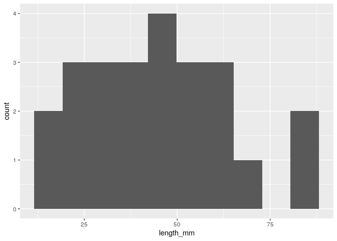
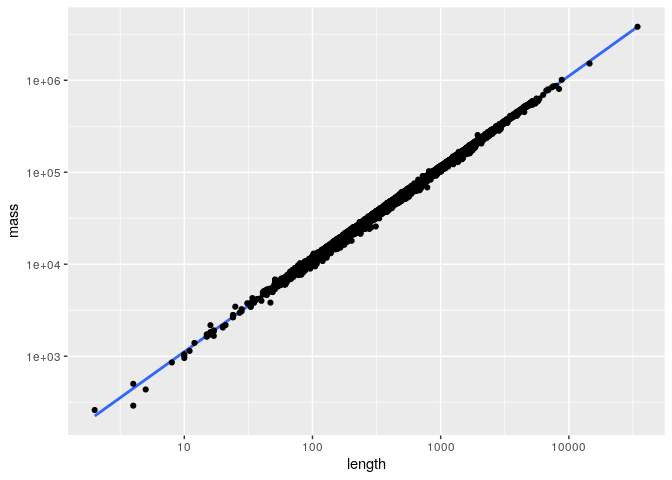

Task8
================
Gina Miku Oba
2023-03-08

# Task8

Install Tidybiology package, which includes the data ‘chromosome’ and
‘proteins’.

``` r
devtools::install_github("hirscheylab/tidybiology")
```

    ## Skipping install of 'tidybiology' from a github remote, the SHA1 (d03a810a) has not changed since last install.
    ##   Use `force = TRUE` to force installation

``` r
library("tidybiology")
library("tidyverse")
```

    ## ── Attaching core tidyverse packages ──────────────────────── tidyverse 2.0.0 ──
    ## ✔ dplyr     1.1.0     ✔ readr     2.1.4
    ## ✔ forcats   1.0.0     ✔ stringr   1.5.0
    ## ✔ ggplot2   3.4.1     ✔ tibble    3.1.8
    ## ✔ lubridate 1.9.2     ✔ tidyr     1.3.0
    ## ✔ purrr     1.0.1     
    ## ── Conflicts ────────────────────────────────────────── tidyverse_conflicts() ──
    ## ✖ dplyr::filter() masks stats::filter()
    ## ✖ dplyr::lag()    masks stats::lag()
    ## ℹ Use the ]8;;http://conflicted.r-lib.org/conflicted package]8;; to force all conflicts to become errors

``` r
library("ggplot2")
```

`chromosome` data contains 24 rows (chromosome from 1 to 22 and X,Y)
with 14 columns (information of the chromosome such as basepairs and
protein coding gene numbers).

``` r
print(head(chromosome))
```

    ## # A tibble: 6 × 14
    ##   id    length_mm basepairs varia…¹ prote…² pseud…³ total…⁴ total…⁵ mi_rna r_rna
    ##   <fct>     <dbl>     <dbl>   <dbl>   <int>   <int>   <int>   <int>  <int> <int>
    ## 1 1            85 248956422  1.22e7    2058    1220    1200     496    134    66
    ## 2 2            83 242193529  1.29e7    1309    1023    1037     375    115    40
    ## 3 3            67 198295559  1.06e7    1078     763     711     298     99    29
    ## 4 4            65 190214555  1.02e7     752     727     657     228     92    24
    ## 5 5            62 181538259  9.52e6     876     721     844     235     83    25
    ## 6 6            58 170805979  9.13e6    1048     801     639     234     81    26
    ## # … with 4 more variables: sn_rna <int>, sno_rna <int>, miscnc_rna <int>,
    ## #   centromereposition_mbp <dbl>, and abbreviated variable names ¹​variations,
    ## #   ²​protein_codinggenes, ³​pseudo_genes, ⁴​totallongnc_rna, ⁵​totalsmallnc_rna

``` r
print(dim(chromosome))
```

    ## [1] 24 14

``` r
print(chromosome$id)
```

    ##  [1] 1  2  3  4  5  6  7  8  9  10 11 12 13 14 15 16 17 18 19 20 21 22 X  Y 
    ## Levels: 1 2 3 4 5 6 7 8 9 10 11 12 13 14 15 16 17 18 19 20 21 22 X Y

`proteins` data contains 20430 rows (proteins) with 8 columns
(infomation of the proteins such as amino asid length and amino asid
sequence).

``` r
print(head(proteins))
```

    ## # A tibble: 6 × 8
    ##   uniprot_id gene_name gene_name_alt   protein_n…¹ prote…² seque…³ length   mass
    ##   <chr>      <chr>     <chr>           <chr>       <chr>   <chr>    <dbl>  <dbl>
    ## 1 P04217     A1BG      <NA>            "Alpha-1B-… Alpha-… MSMLVV…    495  54254
    ## 2 Q9NQ94     A1CF      ACF ASP         "APOBEC1 c… APOBEC… MESNHK…    594  65202
    ## 3 P01023     A2M       CPAMD5 FWP007   "Alpha-2-m… Alpha-… MGKNKL…   1474 163291
    ## 4 A8K2U0     A2ML1     CPAMD9          "Alpha-2-m… C3 and… MWAQLL…   1454 161107
    ## 5 U3KPV4     A3GALT2   A3GALT2P IGBS3S "Alpha-1,3… EC 2.4… MALKEG…    340  38754
    ## 6 Q9NPC4     A4GALT    A14GALT A4GALT1 "Lactosylc… EC 2.4… MSKPPD…    353  40499
    ## # … with abbreviated variable names ¹​protein_name, ²​protein_name_alt, ³​sequence

``` r
print(dim(proteins))
```

    ## [1] 20430     8

## a. summary statistics of `chromosome` data using tidyverse

``` r
chromosome %>% select(variations, protein_codinggenes, mi_rna) %>%
  # add extra M to separate after
  summarise(across(everything(), list(Mmean = mean, Mmedian = median, Mmaximum = max))) %>%
  # Shaped to table type
  # if names_sep is just "_", protein_codinggenes and mi_rna also separated.
  # use "_M" to separate
  pivot_longer(cols = everything(), names_to = c(".value", "variable"), names_sep = "_M")
```

    ## # A tibble: 3 × 4
    ##   variable variations protein_codinggenes mi_rna
    ##   <chr>         <dbl>               <dbl>  <dbl>
    ## 1 mean       6484572.                850.   73.2
    ## 2 median     6172346                 836    75  
    ## 3 maximum   12945965                2058   134

## b. Visualize chromosome size distribution

chromosome size is `length_mm`. Each chromosome size is plotted as
below.

``` r
p <- ggplot(chromosome,aes(y=length_mm,  x= id)) +
  geom_bar(stat = "identity")
print(p)
```

<!-- -->

Histogram is the plot to visualize distribution. I plotted with
binsize=10 and binsize=20. The appearance of the peaks of the
distribution differs depending on the bin size, so I plotted with
binsize=10 and binsize=20; when binsize is 10, the distribution appears
to be normally distributed, and when binsize is 20, it does not show a
clear distribution. Mean of the chromosome length is 43.83, which is
more easily seen in the plot when binsize is 10.

``` r
print(mean(chromosome$length_mm))
```

    ## [1] 43.83333

``` r
# wide binsize
bin = 10
p <- ggplot(chromosome,aes(x=length_mm)) +
  geom_histogram(bins = bin)
print(p)
```

<!-- -->

``` r
# sharp binsize
bin = 20
p <- ggplot(chromosome,aes(x=length_mm)) +
  geom_histogram(bins = bin)
print(p)
```

<!-- -->

## c. Does the number of protein coding genes or miRNAs correlate with the length of the chromosome?

Both protein coding genes and miRNAs positively correlate with the
chromosome length, but miRNA show a higher correlation (0.74) than
protein coding genes (0.61).

### 1. protein coding genes vs length visualization

``` r
corr <- cor(chromosome$protein_codinggenes, chromosome$length_mm)
print(corr)
```

    ## [1] 0.6060185

``` r
p <- ggplot(chromosome,aes(x=protein_codinggenes , y=length_mm)) +
  geom_smooth(method=lm, se=FALSE, formula = y ~ x) + 
  annotate("text",x=-Inf,y=Inf,label=paste("correlation:", round(corr,2)),hjust=-.2,vjust=2) +
  geom_point()
print(p)
```

<!-- -->

### 2. miRNAs vs length visualization

``` r
corr <- cor(chromosome$mi_rna, chromosome$length_mm)
print(corr)
```

    ## [1] 0.7366973

``` r
p <- ggplot(chromosome,aes(x=mi_rna , y=length_mm)) +
  geom_smooth(method=lm, se=FALSE, formula = y ~ x) + 
  annotate("text",x=-Inf,y=Inf,label=paste("correlation:", round(corr,2)),hjust=-.2,vjust=2) +
  geom_point()
print(p)
```

<!-- -->

## d. summary statistics of `proteins`.

### 1. statistics

``` r
proteins %>% select(length, mass) %>%
  # add extra M to separate after
  summarise(across(everything(), list(Mmean = mean, Mmedian = median, Mmaximum = max))) %>%
  # Shaped to table type
  # if names_sep is just "_", protein_codinggenes and mi_rna also separated.
  # use "_M" to separate
  pivot_longer(cols = everything(), names_to = c(".value", "variable"), names_sep = "_M")
```

    ## # A tibble: 3 × 3
    ##   variable length     mass
    ##   <chr>     <dbl>    <dbl>
    ## 1 mean       557.   62061.
    ## 2 median     414    46140.
    ## 3 maximum  34350  3816030

### 2. Visualization

First, the correlation of length and mass is visualized same as
chromosome. It shows that length and mass are highly correlated. But
there seems scale of the large protein is differ with small proteins. In
the second plot, a log10 scale transformation was performed for both x-
and y-axes. This showed that the length and weight of the protein were
highly correlated.

``` r
corr <- cor(proteins$length, proteins$mass)
print(corr)
```

    ## [1] 0.9991674

``` r
p <- ggplot(proteins,aes(x=length , y=mass)) +
  geom_smooth(method=lm, se=FALSE, formula = y ~ x) + 
  geom_point() +
  annotate("text",x=-Inf,y=Inf,label=paste("correlation:", round(corr,2)),hjust=-.2,vjust=2)
print(p)
```

<!-- -->

``` r
# log - log scale
p <- ggplot(proteins,aes(x=length , y=mass)) +
  geom_smooth(method=lm, se=FALSE, formula = y ~ x) + 
  geom_point() +
  scale_x_continuous(trans='log10') +
  scale_y_continuous(trans='log10') +
  annotate("text",x=-Inf,y=Inf,label=paste("correlation:", round(corr,2)),hjust=-.2,vjust=2)
print(p)
```

    ## Warning in log(x, base): NaNs produced

    ## Warning: Removed 1 rows containing missing values (`geom_text()`).

<!-- -->

``` r
sessionInfo()
```

    ## R version 4.2.2 (2022-10-31)
    ## Platform: x86_64-pc-linux-gnu (64-bit)
    ## Running under: Ubuntu 22.04.1 LTS
    ## 
    ## Matrix products: default
    ## BLAS:   /usr/lib/x86_64-linux-gnu/openblas-pthread/libblas.so.3
    ## LAPACK: /usr/lib/x86_64-linux-gnu/openblas-pthread/libopenblasp-r0.3.20.so
    ## 
    ## locale:
    ##  [1] LC_CTYPE=en_US.UTF-8       LC_NUMERIC=C              
    ##  [3] LC_TIME=en_US.UTF-8        LC_COLLATE=en_US.UTF-8    
    ##  [5] LC_MONETARY=en_US.UTF-8    LC_MESSAGES=en_US.UTF-8   
    ##  [7] LC_PAPER=en_US.UTF-8       LC_NAME=C                 
    ##  [9] LC_ADDRESS=C               LC_TELEPHONE=C            
    ## [11] LC_MEASUREMENT=en_US.UTF-8 LC_IDENTIFICATION=C       
    ## 
    ## attached base packages:
    ## [1] stats     graphics  grDevices utils     datasets  methods   base     
    ## 
    ## other attached packages:
    ##  [1] lubridate_1.9.2   forcats_1.0.0     stringr_1.5.0     dplyr_1.1.0      
    ##  [5] purrr_1.0.1       readr_2.1.4       tidyr_1.3.0       tibble_3.1.8     
    ##  [9] ggplot2_3.4.1     tidyverse_2.0.0   tidybiology_0.1.0
    ## 
    ## loaded via a namespace (and not attached):
    ##  [1] Rcpp_1.0.9        lattice_0.20-45   prettyunits_1.1.1 ps_1.7.2         
    ##  [5] digest_0.6.31     utf8_1.2.2        mime_0.12         R6_2.5.1         
    ##  [9] evaluate_0.20     highr_0.10        pillar_1.8.1      rlang_1.0.6      
    ## [13] curl_5.0.0        rstudioapi_0.14   miniUI_0.1.1.1    callr_3.7.3      
    ## [17] urlchecker_1.0.1  Matrix_1.5-3      rmarkdown_2.20    splines_4.2.2    
    ## [21] labeling_0.4.2    devtools_2.4.5    htmlwidgets_1.6.1 munsell_0.5.0    
    ## [25] shiny_1.7.4       compiler_4.2.2    httpuv_1.6.8      xfun_0.36        
    ## [29] pkgconfig_2.0.3   pkgbuild_1.4.0    mgcv_1.8-41       htmltools_0.5.4  
    ## [33] tidyselect_1.2.0  fansi_1.0.3       crayon_1.5.2      tzdb_0.3.0       
    ## [37] withr_2.5.0       later_1.3.0       grid_4.2.2        nlme_3.1-161     
    ## [41] xtable_1.8-4      gtable_0.3.1      lifecycle_1.0.3   magrittr_2.0.3   
    ## [45] scales_1.2.1      cli_3.6.0         stringi_1.7.12    cachem_1.0.6     
    ## [49] farver_2.1.1      fs_1.5.2          promises_1.2.0.1  remotes_2.4.2    
    ## [53] ellipsis_0.3.2    generics_0.1.3    vctrs_0.5.2       tools_4.2.2      
    ## [57] glue_1.6.2        hms_1.1.2         processx_3.8.0    pkgload_1.3.2    
    ## [61] fastmap_1.1.0     yaml_2.3.6        timechange_0.2.0  colorspace_2.1-0 
    ## [65] sessioninfo_1.2.2 memoise_2.0.1     knitr_1.41        profvis_0.3.7    
    ## [69] usethis_2.1.6
